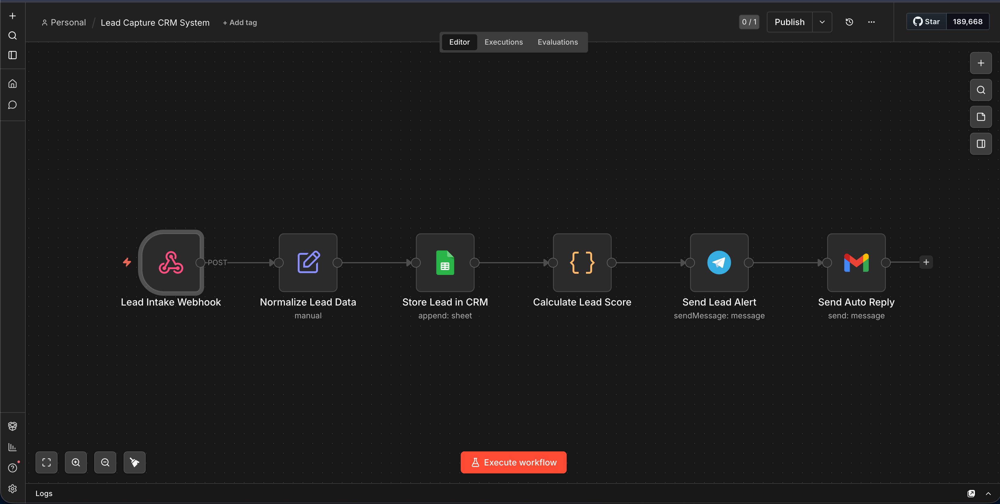

# 🚀 n8n Lead Capture CRM

A production-style Lead Capture & CRM Automation workflow built with **n8n**.

This workflow automatically captures incoming leads, stores them in a CRM database, calculates lead quality, sends real-time Telegram notifications, and delivers automated email replies.

Perfect for:
- freelancers
- agencies
- small businesses
- CRM automation projects
- sales workflow automation

---

# 📌 Overview

This project creates a lightweight automated CRM pipeline using n8n.

Whenever a new lead arrives from a form, webhook, or API, the workflow will:

- capture the lead data
- normalize the payload
- store the lead inside Google Sheets
- calculate a lead score
- send a Telegram notification
- send an automated email reply

---

# ⚡ Workflow Architecture

```text
Webhook Trigger
        ↓
Normalize Lead Data
        ↓
Store Lead in CRM
        ↓
Calculate Lead Score
        ↓
Send Lead Alert
        ↓
Send Auto Reply
```

---

# 📸 Workflow Preview



---

# ✨ Features

## ✅ Lead Capture

Accepts lead data from:
- website forms
- APIs
- webhooks
- Typeform
- Tally
- Webflow

---

## ✅ CRM Storage

Stores leads inside Google Sheets.

Tracked fields:
- full_name
- email
- company
- budget
- service
- message
- lead_source
- created_at
- lead_score
- status

---

## ✅ Lead Scoring

Automatically scores leads based on:
- budget
- company existence
- requested service

Priority levels:
- low
- medium
- high

---

## ✅ Telegram Notifications

Sends instant lead alerts directly to Telegram.

Example:

```text
🚀 New Lead Captured

👤 Name: John Carter
🏢 Company: Carter Studio
💰 Budget: $5000
📈 Score: 80
🔥 Priority: high
📧 Email: john@example.com
🛠 Service: Website Development
```

---

## ✅ Automated Email Replies

Automatically sends confirmation emails to incoming leads.

---

# 🛠 Tech Stack

| Tool | Purpose |
|---|---|
| n8n | Workflow Automation |
| Google Sheets | CRM Database |
| Telegram Bot API | Notifications |
| Gmail API | Automated Emails |

---

# 📂 Project Structure

```text
n8n-lead-capture-crm/
├── workflows/
│   └── lead-capture-crm.workflow.json
├── docs/
│   └── screenshots/
│       └── workflow-overview.png
├── sample-data/
│   └── sample-leads.json
├── templates/
│   ├── telegram-message.md
│   └── auto-reply-email.md
├── README.md
├── .env.example
└── LICENSE
```

---

# ⚙️ Setup

## 1. Import Workflow

Import:

```text
workflows/lead-capture-crm.workflow.json
```

into your n8n instance.

---

## 2. Configure Google Sheets

Create a Google Sheet with these columns:

```text
full_name
email
company
budget
service
message
lead_source
created_at
lead_score
status
```

---

## 3. Connect Credentials

Inside n8n connect:
- Google Sheets OAuth
- Telegram Bot API
- Gmail OAuth

---

## 4. Activate Workflow

Enable the workflow and use the webhook endpoint for lead intake.

---

# 🧪 Example Payload

```json
{
  "full_name": "John Carter",
  "email": "john@example.com",
  "company": "Carter Studio",
  "budget": 5000,
  "service": "Website Development",
  "message": "Need a modern business website"
}
```

---

# 📈 Real Business Use Cases

## Freelancers

Capture website inquiries automatically.

---

## Agencies

Track incoming client requests in one place.

---

## Small Businesses

Avoid losing potential customers.

---

## Sales Teams

Create a lightweight CRM pipeline.

---

# 🌱 Future Improvements

- duplicate lead prevention
- PostgreSQL integration
- Airtable integration
- AI lead qualification
- Slack notifications
- dashboard & analytics
- follow-up reminders

---

# 📄 License

MIT License

---

# 👨‍💻 Author

Built by Amir Ali Baramar
